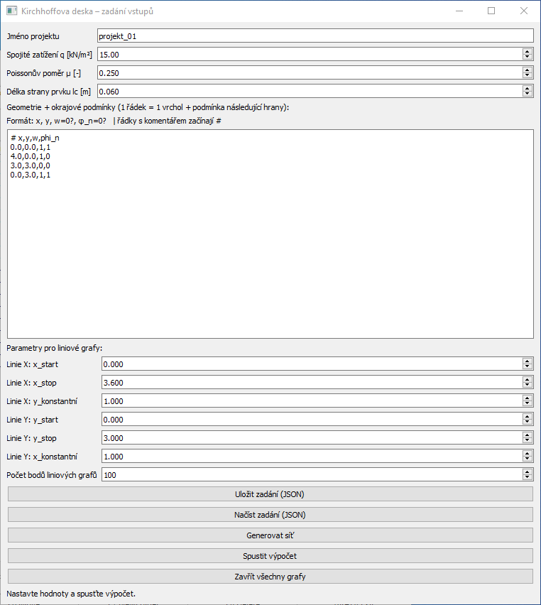
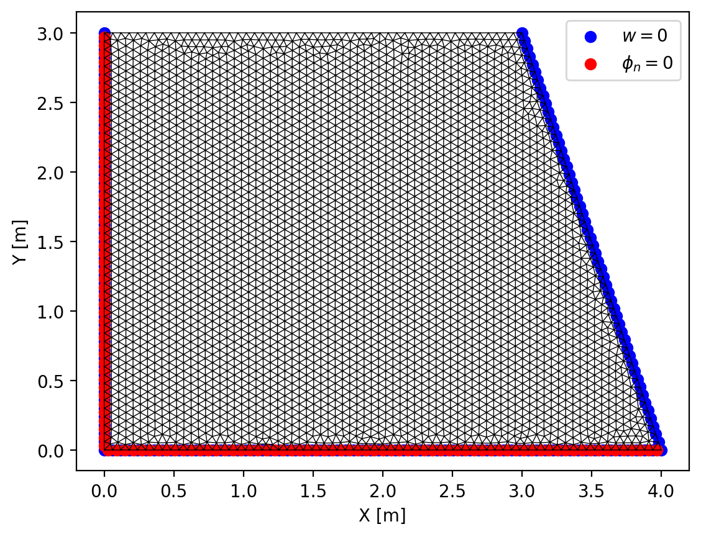
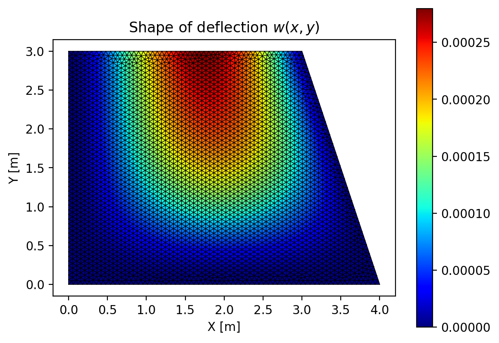
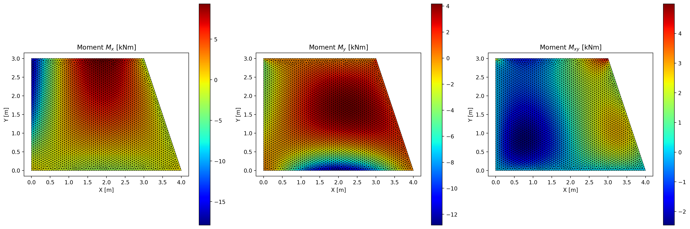
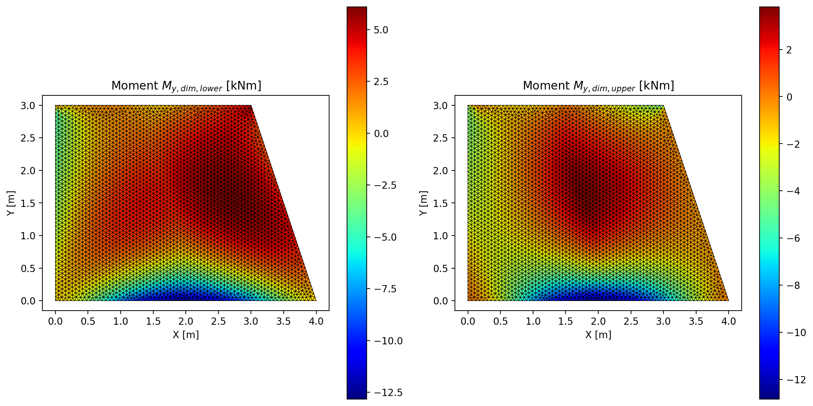
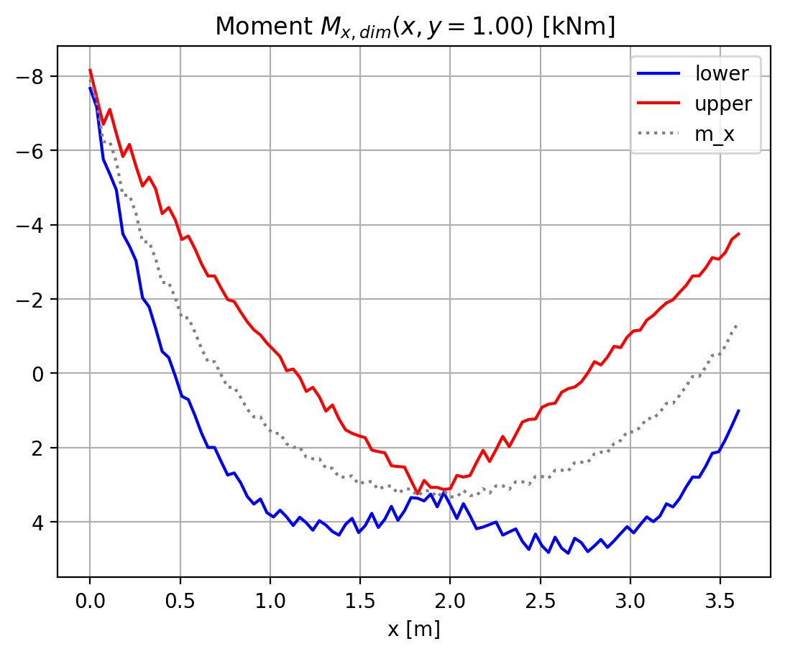
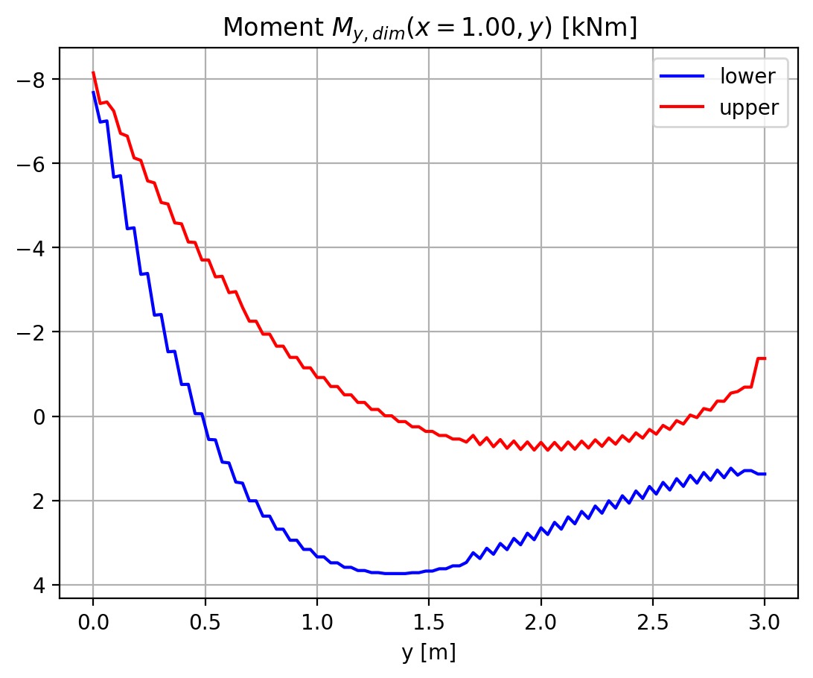

# Kirchhoff_plate

Jednoduchý program pro výpočet Kirchhoffovy desky pomocí
jednoduchých prvků Morley. Jedná se o nejjednodušší prvek MPK, kterým
lze řešit tuto problematiku.

---

## Cíl

Hlavním cílem je:

- výukový program,
- demonstrovat použití MKP,
- demonstrovat ohybové momenty na desce včetně krouticích,
- ukázat problematiku dimenzačních mometů v železobetonu.


## Klíčové soubory

1. **kirchhoff_plate.py** – vlastní výpočet,
2. **kirchhoff_plate_gui.py** – jednoduché GUI pro zadání vstupů výpočtu.

## Jak začít

Příkazy jsou použity pro systém Windows. V případě Linux nebo macOS je třeba
použít odpovídající ekvivalenty pro tyto systémy, např. `python3` místo `python` atd.

Je třeba mít instalován Python a odpovídající závislosti.

```bash
pip install PyQt5 numpy scikit-fem matplotlib gmsh
```

Spuštění aplikace např. příkazem 
```bash
python kirchhoff_plate_gui.py
```

## Hlavní okno

Vstupní data se zadávají pomocí hlavního okna aplikace.



Hlavní okno obsahuje několik položek:

- Spojité zatížení na desku
- Tloušťka desky
- Modul pružnosti
- Poissonův poměr
- Délka strany prvku - generuje se síť MKP s tímto parametrem
- Geometrie desky - se zadává pomocí tabulky, každá řádek začíná souřadnicemi 
vrcholu polygonu a následují boolen proměnné, které se váže k následující 
straně polygonu a určují okrajové podmínky. Např. kombinace [0,0] je pro volný okraj desky, [1,1] vetknutí, [0,1] podmínka osy symetrie, [1,0] válcový kloub.
- Parametry pro liniové grafy - je možné zadat úsečky rovnoběžnou s osou X a Y, pro kterou se vykreslí grafy průběhu dimenzačních mometů.
- Počet bodů liniového grafu - stanový počet bodů na úcečce, pro které se budou hledat výsledky v síti MKP.

Tlačítko **Spustit výpočet** zahájí výpočetní proces a zobrazení grafů.

Pro výpočet ohybových mometů nemá vliv volba parametrů tloušťky desky a modulu pružnosti. Tvar průhybu (deformace) je pouze orientační, je pro lineární materiál, což ovšem beton není. 
Dimenzační momenty jsou počítány nejjednodušší metodou, tj. $M_{x,dim,lower} = M_x + |M_{xy}|$, $M_{x,dim,upper} = M_x - |M_{xy}|$ a podobně pro směr $Y$.

Hlavní panel je potom neaktivní až do uzavření všech oken s grafy.

Výsledky se zapíší i do aktuálního adresáře (PDF soubor a JPG soubory).















